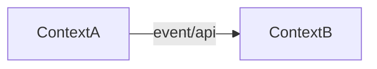

# Bounded contexts (normative)

**Produced in:** P0 (initial), refined P1. **Artifact:** `BOUNDED_CONTEXTS.md`.

Identify bounded contexts from repo boundaries, package roots, API namespaces, and domain language in code.

## Per-context card (required)

| Field | Content |
|-------|---------|
| **Context name** | e.g. Disbursement execution, Bank rails, Documents |
| **Owner** | Squad from `SQUAD_MAP.md` or UNKNOWN |
| **Repositories** | List |
| **Primary entities** | Domain models / tables (with authoritative repo) |
| **Public APIs** | Entry HTTP/gRPC (link `API_CATALOG.md`) |
| **Events published** | Link `EVENT_CATALOG.md` |
| **Events consumed** | Link `EVENT_CATALOG.md` |
| **Data ownership** | Link `DATA_OWNERSHIP.md` entities |
| **Upstream contexts** | Who calls in |
| **Downstream contexts** | Who this calls |
| **Confidence** | Section confidence ([confidence-rubric.md](confidence-rubric.md)) |

## Detection heuristics (evidence required)

- Separate deployable / repo per context
- Shared library ≠ shared context — trace who owns writes
- BFF contexts are thin — mark **edge** not core domain
- Bank/integration adapters = supporting context

## Context map diagram

Required in `BOUNDED_CONTEXTS.md`:

Edges need evidence (HTTP client, topic producer/consumer, shared migration).
